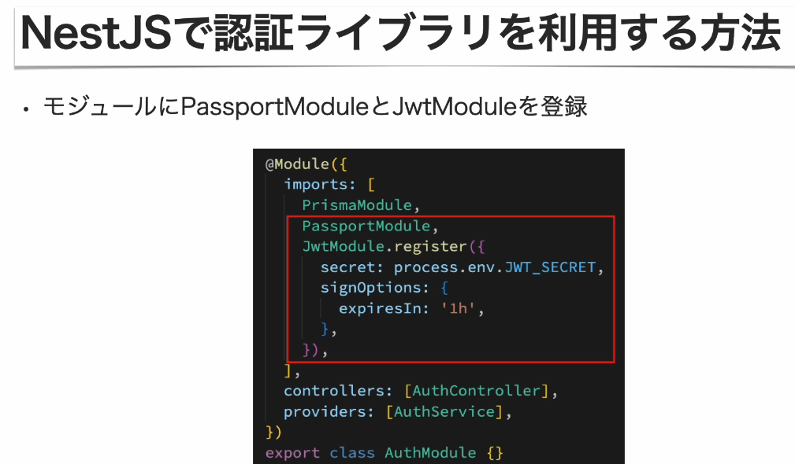

# JWTとは

- JSON Web Tokenの略称で、JSONの形をした認証情報
- 電子署名により、改ざんの検知が可能
- 認証用のトークンとして利用される

# JWTの構成

- 3つの要素から構成される
  - **ヘッダ**：ハッシュアルゴリズムの情報などのメタデータ
  - **ペイロード**：認証対象の情報で、ユーザー名やIDなど任意の情報
  - **署名**：ヘッダとペイロードをエンコードしたものに秘密鍵を加えてハッシュ化したもの
- 要素ごとにBase64エンコードされている
- 3つの要素が「.」（ドット）で結合されている


# JWTのメリット

- 署名が含まれているため、改ざんをチェックできる
- 有効期限をつけるなど、セキュアなToken発行を行える
- セッションと異なり、状態をサーバーで管理する必要がない
- 任意のデータをTokenに含めることができる


# NestJSでJWTを扱う方法

- passport
  - ストラテジー：どのように認証するかという認証方法
- passport-jwt
- @nestjs/passport
- @nestjs/jwt



```bash
npm i passport @nestjs/passport
```

```bash
npm i passport-jwt @nestjs/jwt
```

```bash
npm i -D @types/passport-jwt
```

# .envのJWT_SECRET生成
```bash
openssl rand -hex 32
```

# jwtのテスト
- https://www.jwt.io/
