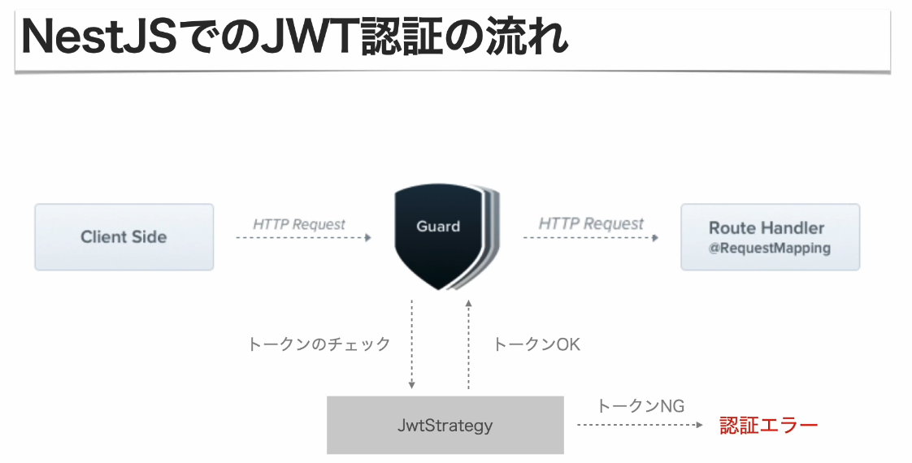

# Guard

- アクセス制御や認証のために用いられるNestJSの機能
- 特定の条件が満たされた時にのみルートハンドラーが実行されるようになる
- アプリケーションのセキュリティ要件に合わせて認証・認可のロジックをカスタマイズ可能
- 同じGuardをアプリケーションの複数の場所で使用できる

# Guardの利用方法

## 1. ハンドラへの適用

```typescript
@UseGuards(AuthGuard('jwt'))
@Post()
async create(@Body() createItemDto: CreateItemDto): Promise<Item> {
  // ...
}
```

## 2. Controllerへの適用

```typescript
@Controller('items')
@UseGuards(AuthGuard('jwt'))
export class ItemsController {
  // ...
}
```

# JWTの正当性を検証するJwtStrategy

`jwt.strategy.ts`

```typescript
import { PassportStrategy } from '@nestjs/passport';
import { ExtractJwt, Strategy } from 'passport-jwt';

@Injectable()
export class JwtStrategy extends PassportStrategy(Strategy) {
  constructor() {
    super({
      jwtFromRequest: ExtractJwt.fromAuthHeaderAsBearerToken(),
      ignoreExpiration: false,
      secretOrKey: process.env.JWT_SECRET,
    });
  }

  async validate(payload: JwtPayload) {
    return { id: payload.sub, name: payload.username, status: payload.status };
  }
}
```

# （まとめ）NestJSでのJWT認証の流れ

1. JWTを生成・取得
2. クライアントがJWTをAuthorizationヘッダーに追加してリクエスト送信
3. AuthGuardの起動
4. JWTの抽出・JWTの検証
5. JWTからユーザー情報の取得と返却
6. ルートハンドラーへアクセス